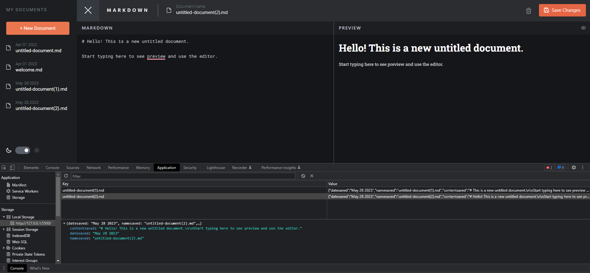

# Frontend Mentor - In-browser markdown editor solution

This is a solution to the [In-browser markdown editor challenge on Frontend Mentor](https://www.frontendmentor.io/challenges/inbrowser-markdown-editor-r16TrrQX9). Frontend Mentor challenges help you improve your coding skills by building realistic projects. 

## Table of contents

- [Overview](#overview)
  - [The challenge](#the-challenge)
  - [Screenshot](#screenshot)
  - [Links](#links)
- [My process](#my-process)
  - [Built with](#built-with)
  - [What I learned](#what-i-learned)
  - [Continued development](#continued-development)
  - [Useful resources](#useful-resources)
- [Author](#author)

## Overview

### The challenge

Users should be able to:

- Create, Read, Update, and Delete markdown documents 
- Name and save documents to be accessed as needed
- Edit the markdown of a document and see the formatted preview of the content
- View a full-page preview of the formatted content
- View the optimal layout for the app depending on their device's screen size
- See hover states for all interactive elements on the page
- **Bonus**: If you're building a purely front-end project, use localStorage to save the current state in the browser that persists when the browser is refreshed

### Screenshot

- Main: 
- Sidebar + hide preview + light theme: 
- Saving to localStorage:  

### Links

- Solution URL: [Add solution URL here](https://your-solution-url.com)
- Live Site URL: [Add live site URL here](https://your-live-site-url.com)

## My process

### Built with

- Semantic HTML5 markup
- CSS custom properties
- Flexbox
- CSS Grid
- Desktop-first workflow
- [Bootstrap 5](https://getbootstrap.com/docs/5.3/getting-started/introduction/) - For sidebar
- [Marked.js](https://marked.js.org/using_advanced) - For markdown editor
- [Styled Components](https://styled-components.com/) - For styles

### What I learned

- [Sticky positioning](https://developer.mozilla.org/en-US/docs/Web/CSS/position#sticky_positioning) - I use this to lock the sidebar while the main container scrolls. For the height of the sidebar, I wanted to set to 100svh as 100vh is affected by the bottom horizontal scroll. Somehow the svh is not working as expected thus I hid the bottom horizontal scroll at the body element instead.

- Learn how to use another js library - marked.js.

- Learn how to use localStorage. This can be quite useful in the future when I want to built a trial or test project without having to fully launching it as a full-stack application first.

- Understanding the difference, the advantages and disadvantages between using functional statement and functional expressions in javascript, learning the purpose of using anonymous functions with event listeners. 
  1. Function Statement:
      - Use a function statement when you want to declare a named function that can be accessed anywhere within its scope.
      - Function statements are hoisted, meaning they are moved to the top of their scope during the compilation phase. This allows you to call the function before its declaration in the code.
  2. Function Expression:
      - Use a function expression when you want to assign a function to a variable or a property of an object.
      - Function expressions can be either named or anonymous.
      - Function expressions are not hoisted, so you must define them before using them in the code.

In short, **use function declarations when you want to create a function on the global scope and make it available throughout your code**. Use function expressions to limit where the function is available, keep your global scope light, and maintain clean syntax.

### Continued development

To develop this into a full stack application.

### Useful resources

- [Bootstrap 5 Sidebar Menu - Simple](https://www.codeply.com/p/LXYndDByBf) - This helped me for XYZ reason. I really liked this pattern and will use it going forward.
-[How to use localStorage](https://www.section.io/engineering-education/how-to-use-localstorage-with-javascript/) - This guy did a simple well-explained example on how to use localStorage.

## Author

- Frontend Mentor - [@Jo-cloud85](https://www.frontendmentor.io/profile/Jo-cloud85)

